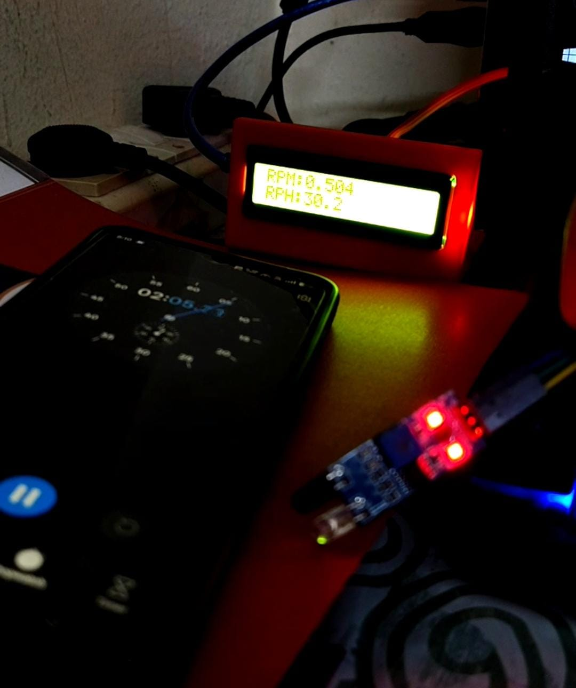
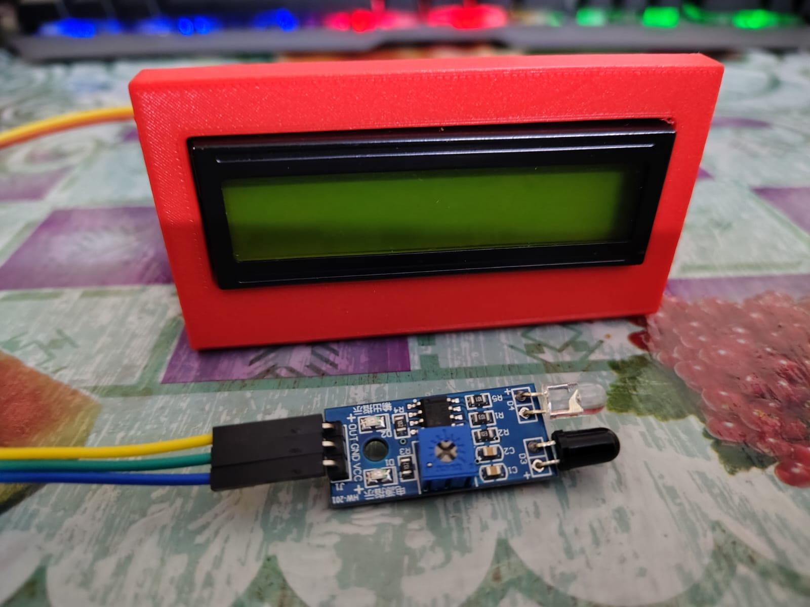
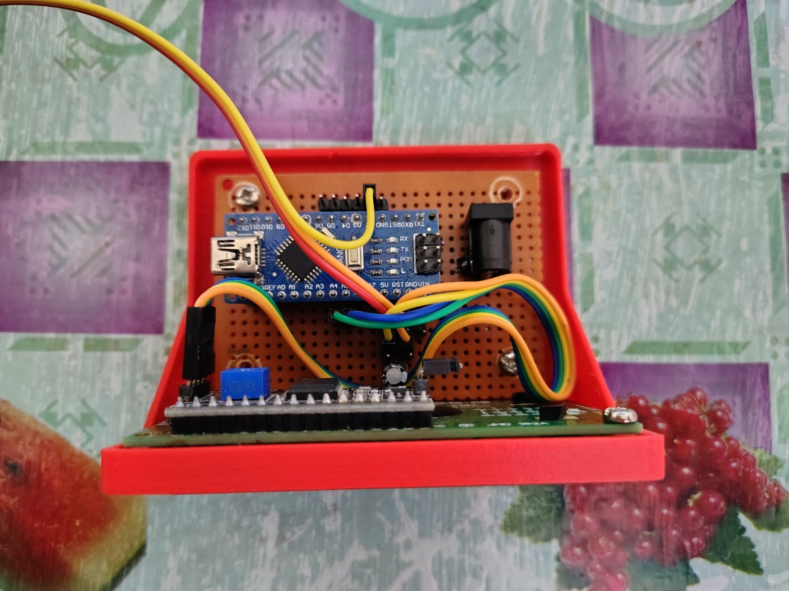
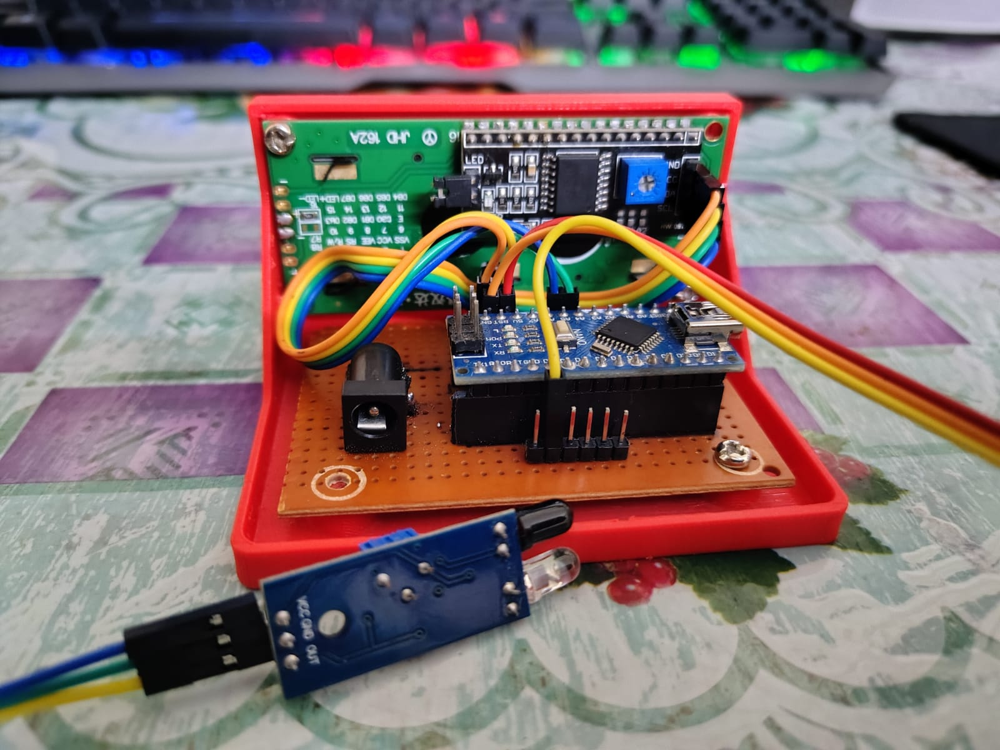
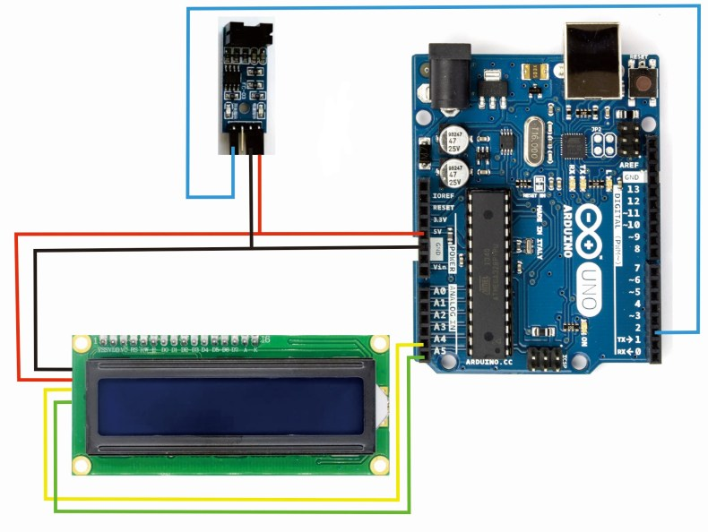

# Arduino Nano Advanced Tachometer V2


*Arduino Nano tachometer with 3D-printed case and LCD display*

## Overview

This project is a robust, configurable digital tachometer using an Arduino Nano, a TCRT5000 IR reflective sensor, and a 16x2 I2C LCD display housed in a custom 3D-printed case. It measures RPM (revolutions per minute), RPH (revolutions per hour), and total revolutions of a rotating object with black strips/markers. The system features high precision, floating-point display, and advanced debouncing for reliable measurements in various environments.

## Project Images

### Assembled Device


*Front view showing the LCD display and compact red case*


*Internal view showing Arduino Nano, IR sensor, mount and wiring*


*Side view showing the breadboard layout and connections*

### Wiring

*Wiring is same for Arduino nano*

## Key Features

- **High Precision Measurements**: Uses floating-point calculations for accurate RPM readings with decimal places
- **Configurable Pulse Detection**: Set the number of markers/strips on your wheel for accurate measurement
- **Advanced Smoothing**: Configurable `RPM_SMOOTHING` factor for stable, noise-immune readings
- **Metal-Optimized Debouncing**: `DEBOUNCE_MICROS` setting prevents false readings from reflective metal surfaces
- **Interrupt-Driven Detection**: Hardware interrupts for precise pulse timing without blocking main loop
- **Pulse Timeout Protection**: Automatically resets to zero after specified inactivity period
- **Total Revolution Tracking**: Cumulative rotation counter
- **Custom 3D-Printed Enclosure**: Professional-looking protective case with easy access
- **Direct 5V Power Supply**: Simplified power delivery with capacitive filtering

## 3D Printed Case Files

### STL Files Included

- **`tachometer_case.stl`** - Open case for the tachometer project where lcd display and the arduino nano on perfboard is mounted.

### Print Settings

| Parameter | Value | Notes |
|-----------|--------|-------|
| Layer Height | 0.2mm | For good surface finish |
| Infill | 20-25% | Sufficient strength |
| Perimeters | 3-4 | Strong walls |
| Support | Only for overhangs | Minimal supports needed |
| Material | PLA or PLA+ | Easy to print, durable |
| Print Speed | 50-80mm/s | Quality over speed |
| Nozzle Temperature | 210°C (PLA+) | Adjust for your filament |
| Bed Temperature | 60°C | Good adhesion |

### Case Features

- **LCD Window**: Precision-cut opening for 16x2 display
- **Arduino Mounts**: Secure mounting points for Arduino Nano
- **IR Sensor Bracket**: Adjustable positioning for optimal detection
- **Cable Management**: Built-in channels for clean wiring
- **Power Jack Access**: Easy access to DC power connector
- **Ventilation**: Air vents for heat dissipation
- **Professional Finish**: Smooth surfaces with minimal post-processing needed

## Hardware Requirements

### Electronic Components

- Arduino Nano (or compatible)
- TCRT5000 IR reflective sensor module
- 16x2 I2C LCD (address 0x27 or 0x3F)
- 22μF 50V electrolytic capacitor
- 5V DC power adapter (2A recommended)
- DC barrel jack (5.5mm x 2.1mm)
- Perfboard or PCB
- Header pins and jumper wires

### Hardware Components

- M3 screws (various lengths: 6mm, 12mm, 16mm)
- M3 nuts
- Heat shrink tubing
- Reflective tape or markers for target object

## Library Requirements

### Wire (Built-in)

No installation required - included with Arduino IDE.

### LiquidCrystal_I2C (External)

**Option A: Arduino Library Manager**

1. Open Arduino IDE
2. Go to **Sketch → Include Library → Manage Libraries...**
3. Search for "LiquidCrystal I2C"
4. Install "LiquidCrystal I2C by Frank de Brabander"

**Option B: Manual Installation**

1. Download from [GitHub](https://github.com/johnrickman/LiquidCrystal_I2C)
2. **Sketch → Include Library → Add .ZIP Library...**
3. Select downloaded ZIP file

## Wiring Diagram

| Component | Arduino Nano Pin | Wire Color | Notes |
|-----------|-----------------|------------|-------|
| **TCRT5000** | | | |
| VCC | 5V | Red | Power supply |
| GND | GND | Black | Ground |
| OUT | D2 (INT0) | Blue | Digital output, interrupt |
| **I2C LCD** | | | |
| VCC | 5V | Red | Power supply |
| GND | GND | Black | Ground |
| SDA | A4 | Green | I2C data line |
| SCL | A5 | Yellow | I2C clock line |
| **Power Supply** | | | |
| +5V | 5V | Red | Direct to 5V pin |
| GND | GND | Black | Direct to GND pin |
| **Capacitor** | | | |
| Positive | 5V | Red | 22μF electrolytic |
| Negative | GND | Black | Observe polarity! |

### ⚠️ **IMPORTANT POWER SUPPLY WARNINGS**

- **Never connect USB and 5V power simultaneously!** This can damage your Arduino
- **Check capacitor polarity** - Wrong polarity can cause failure or explosion
- **Use regulated 5V supply** - Input voltage tolerance: 4.8V - 5.2V
- **Current capacity** - Minimum 1A, 2A recommended for stable operation

## Software Configuration

### User-Configurable Constants

```cpp
const uint8_t STRIPS_PER_REVOLUTION = 4;       // Number of black strips/markers
const unsigned long DEBOUNCE_MICROS = 250000;  // 250ms debounce for metal surfaces
const float RPM_SMOOTHING = 0.92;              // Heavy smoothing (0.0-1.0)
const unsigned long PULSE_TIMEOUT = 120000000; // 2 minutes timeout (microseconds)
const uint16_t DISPLAY_UPDATE_INTERVAL = 5000; // 5 seconds display refresh
```

### Configuration Examples

**For a wheel with 6 reflective strips:**

```cpp
const uint8_t STRIPS_PER_REVOLUTION = 6;
```

**For more responsive readings (less stable):**

```cpp
const float RPM_SMOOTHING = 0.80;  // Less smoothing, more responsive
```

**For noisy environments:**

```cpp
const unsigned long DEBOUNCE_MICROS = 500000;  // 500ms debounce
```

## Assembly Instructions

### Step 1: Print the Case

1. Download STL files from the project repository
2. Slice with recommended settings
3. Print the Case

### Step 2: Prepare Electronics

1. **Install capacitor** - Connect 22μF capacitor between 5V and GND pins (observe polarity!)
2. **Mount Arduino** - Secure Arduino Nano to bottom case with M3 screws
3. **Install LCD** - Mount I2C LCD to top case window

### Step 3: Wiring

1. Follow the wiring diagram above
2. Use colored wires for easy identification
3. Test all connections with multimeter
4. Ensure no short circuits

### Step 4: Programming

1. Connect Arduino via USB
2. Select **Tools → Board → Arduino Nano**
3. Select correct **Port**
4. Upload the provided code
5. Open Serial Monitor (115200 baud) for debugging

### Step 5: Final Assembly

1. Mount IR sensor to bracket
2. Position sensor for optimal detection (2-5mm from target)
3. Secure all wiring with zip ties or adhesive
4. Close case with M3 screws
5. Connect 5V power supply (NOT USB!)

## Usage Instructions

### Setup

1. **Prepare target object** - Apply reflective markers or tape at regular intervals
2. **Position sensor** - Mount IR sensor 2-5mm from rotation path
3. **Power on** - Connect 5V DC adapter (never with USB connected!)

### Operation

- **LCD Display** shows real-time RPM, RPH, and total revolutions
- **Serial Monitor** provides detailed debugging information
- **Automatic timeout** resets readings if no pulses detected
- **Precision display** shows decimal values for accurate measurements

### Reading the Display

```
RPM: 123.456    (Current revolutions per minute)
RPH: 7407.4     (Current revolutions per hour)
Total Revs: 456 (Cumulative revolution count)
```

## Troubleshooting

### Common Issues

**No Display on LCD**

- Check I2C address (scan with I2C scanner sketch)
- Verify wiring connections
- Check power supply voltage

**Inaccurate RPM Readings**

- Confirm `STRIPS_PER_REVOLUTION` matches your setup
- Check sensor distance and alignment
- Verify reflective markers are properly applied

**Unstable Readings**

- Increase `RPM_SMOOTHING` factor (closer to 1.0)
- Check for vibrations affecting sensor
- Shield sensor from ambient light

**False Triggers**

- Increase `DEBOUNCE_MICROS` value
- Improve marker contrast (black vs. reflective)
- Check sensor mounting stability

**No Power/Random Resets**

- Check capacitor polarity and connection
- Verify 5V supply stability and current capacity
- Ensure no loose connections

### Serial Debugging

Open Serial Monitor at **115200 baud** for real-time debugging:

- Current RPM, RPH, and revolution count
- Pulse timing information
- System status messages

## Advanced Customization

### Performance Tuning

- **High-speed applications**: Reduce `DEBOUNCE_MICROS` to 50000 (50ms)
- **Low-speed applications**: Increase `PULSE_TIMEOUT` to 300000000 (5 minutes)
- **Noisy environments**: Increase smoothing factor to 0.95+

### Display Modifications

- Change `DISPLAY_UPDATE_INTERVAL` for faster/slower refresh
- Modify code to show additional calculated values
- Add peak RPM recording functionality

## Files in This Repository

```
Arduino-Tachometer-V2/
├── README.md                       # This file
├── LICENSE                         # Opensource MIT License
├── src/
│   ├── tachometer_v2.ino           # Main Arduino sketch
│   └── libraries/                  # Required libraries
├── hardware/
│   ├── 3d_models/
│   │   └── tachometer_case.stl     # Case
│   └── schematics/
│       └── wiring_diagram.png      # Connection diagram                 
├── images/
│   ├── Internal_Components.jpg     # Device photos
│   ├── Mount.jpg
│   ├── Tachometer_Action.jpg
│   └── Tachometer.jpg
└── docs/
    └──  assembly_guide.pdf          # Detailed assembly
```

## Version History

### V2.0 (Current)

- **Floating-point precision** - Decimal RPM/RPH display
- **Simplified power supply** - Direct 5V connection with capacitive filtering
- **Improved debouncing** - Configurable metal-surface debouncing
- **3D-printed case** - Professional enclosure design
- **Interrupt-driven** - Hardware interrupts for precise timing

### V1.0 (Previous)

- Integer RPM display only
- Complex state machine
- EEPROM storage
- Auto-calibration system
- LM7805 voltage regulation

## License

This project is released under the **MIT License**. Feel free to use, modify, and distribute for personal and commercial applications.

## Support

- **Issues**: Report bugs via GitHub Issues
- **Documentation**: Check the `/docs` folder for detailed guides
- **Community**: Join our discussions for tips and improvements

## Acknowledgments

- Thanks to the Arduino community for libraries and inspiration
- STL files designed for optimal printability and functionality
- Tested across multiple hardware configurations for reliability

---

**⚡ Safety Reminder**: Always double-check power connections and never mix USB and external power supplies!
